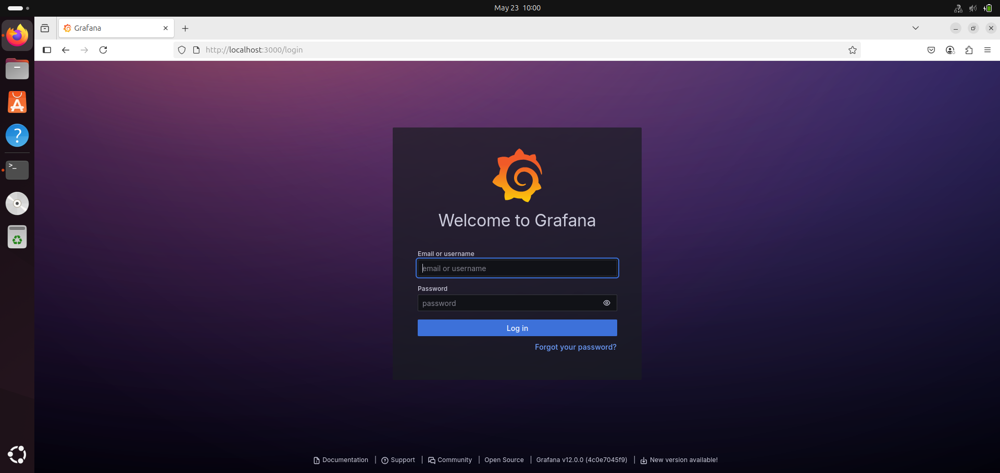
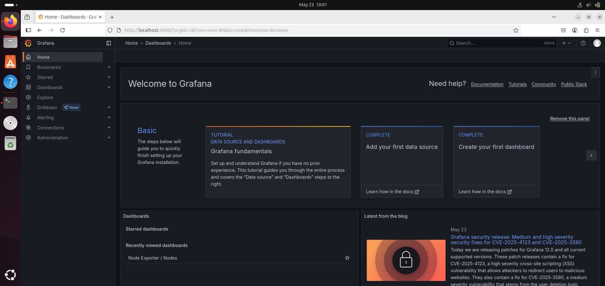
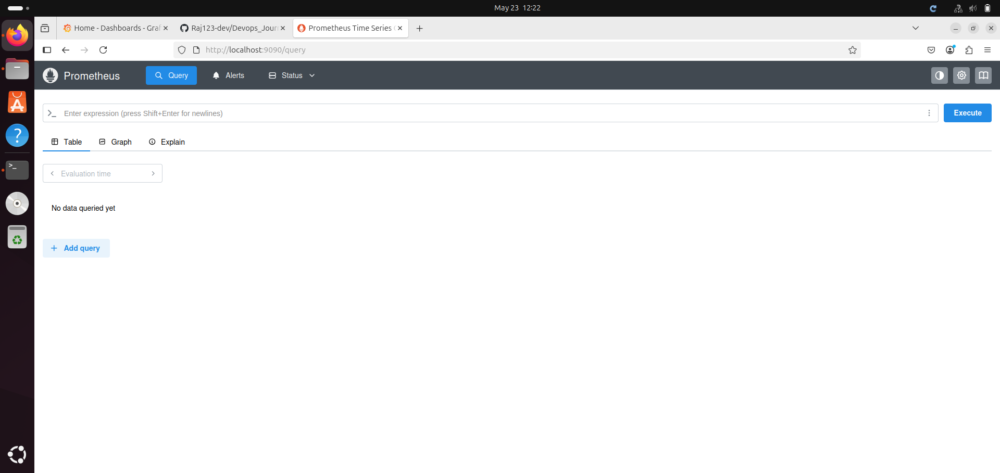

# Prometheus & Grafana Monitoring on Kubernetes (Minikube)

This assignment demonstrates how I set up Prometheus and Grafana to monitor a Kubernetes cluster using Minikube and Helm.

## Prerequisites
- Minikube installed and running
- kubectl configured for your cluster
- Helm installed

---

## 1. I started Minikube
I started my local Kubernetes cluster with:

```sh
minikube start
```

---

## 2. I added the Prometheus Helm repository
I added the Prometheus Community Helm charts and updated them:

```sh
helm repo add prometheus-community https://prometheus-community.github.io/helm-charts
helm repo update
```

---

## 3. I installed the Prometheus Operator Stack
I installed the kube-prometheus-stack using Helm:

```sh
helm install prometheus prometheus-community/kube-prometheus-stack \
  --namespace monitoring \
  --create-namespace \
  --wait \
  --timeout=10m
```

I saw output confirming the deployment. Then, I checked the status of the pods:

```sh
kubectl get pods -n monitoring
```

Example output:
```
NAME                                                     READY   STATUS    RESTARTS   AGE
alertmanager-prometheus-kube-prometheus-alertmanager-0   2/2     Running   0          7m32s
prometheus-grafana-77bcfb9bdb-59rhw                      3/3     Running   0          8m16s
prometheus-kube-prometheus-operator-6d9d668dbd-tkt5z     1/1     Running   0          8m16s
prometheus-kube-state-metrics-7457555cf7-mggv6           1/1     Running   0          8m16s
prometheus-prometheus-kube-prometheus-prometheus-0       2/2     Running   0          7m32s
prometheus-prometheus-node-exporter-v47x5                1/1     Running   0          8m16s
```

---

## 4. I accessed Grafana
Since the Grafana service is `ClusterIP` (internal), I needed to port-forward to access the UI.

First, I got the Grafana admin password:

```sh
kubectl get secrets prometheus-grafana -o jsonpath="{.data.admin-password}" | base64 -d ; echo
```

The default username is `admin` and the password is usually `prom-operator` (I verified with the command above).

I forwarded the Grafana port to my local machine:

```sh
kubectl port-forward -n monitoring svc/prometheus-grafana 3000:80
```

Then, I opened my browser and went to [http://localhost:3000](http://localhost:3000).

- **Grafana Login Page:**
  

I logged in with:
- **Username:** `admin`
- **Password:** `prom-operator`

- **Grafana Home Page:**
  
  
---
## 5. I Accessed Prometheus UI
Like Grafana, Prometheus is also exposed via a ClusterIP service. So I used kubectl port-forward to access the Prometheus UI locally.

First, I found the service:

```sh
kubectl get svc -n monitoring | grep prometheus
```
Example output:
```
prometheus-grafana                        ClusterIP   10.108.10.57     <none>        80/TCP                       5h31m
prometheus-kube-prometheus-alertmanager   ClusterIP   10.96.171.110    <none>        9093/TCP,8080/TCP            5h31m
prometheus-kube-prometheus-operator       ClusterIP   10.108.167.214   <none>        443/TCP                      5h31m
prometheus-kube-prometheus-prometheus     ClusterIP   10.108.220.86    <none>        9090/TCP,8080/TCP            5h31m
prometheus-kube-state-metrics             ClusterIP   10.105.229.171   <none>        8080/TCP                     5h31m
prometheus-operated                       ClusterIP   None             <none>        9090/TCP                     5h30m
prometheus-prometheus-node-exporter       ClusterIP   10.97.218.99     <none>        9100/TCP                     5h31m

```
Then, I forwarded port 9090:

```
kubectl port-forward svc/prometheus-kube-prometheus-prometheus -n monitoring 9090:9090
```
Once it was running, I opened http://localhost:9090 in my browser.

- **Prometheus Home Page:**
  
---
## 6. Useful Commands I Used
- To list all services:
  ```sh
  kubectl get svc -n monitoring
  ```
- To list all deployments:
  ```sh
  kubectl get deployment -n monitoring
  ```
- To check logs for Grafana:
  ```sh
  kubectl logs <grafana-pod-name> -c grafana
  ```

---

This setup shows how I successfully deployed a robust monitoring solution for my Kubernetes cluster using Prometheus and Grafana. I can now explore cluster metrics and dashboards with ease!
